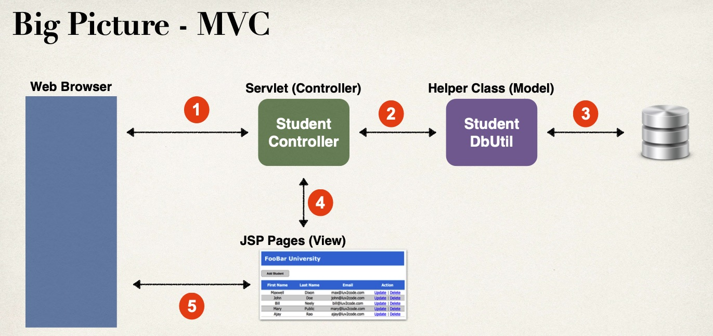

# JSP/Servelt를 활용해 MVC architecture 및 기본적인 CRUD 연습 프로젝트

## 사용된 기술
- JSP/Servlet
- MySQL

## Setup

- MySQL을 localhost:3306로 실행하고 있어야 Tomcat DB connection pool을 활용할 수 있다.(META-INF 폴더 아래 context.xml 참고)
- Tomcat v9.0 사용